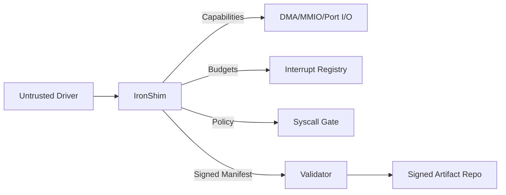

# IronShim-rs

IronShim-rs is a `no_std` Rust micro-shim isolation layer for untrusted drivers, designed for bare-metal operating systems. It enforces capability-based DMA/MMIO/Port I/O access, audited lifecycle control, and versioned ABI boundaries without leaking raw pointers into driver code.


**Languages**
- [English Documentation](docs/README.en.md)
- [Türkçe Dokümantasyon](docs/README.tr.md)

## Highlights

- Capability-bound DMA/MMIO/Port I/O access with per-driver tagging.
- Budgeted interrupt isolation and quarantine on overuse.
- Signed manifest validation with revocation and key rotation hooks.
- ABI versioning and compatibility checks for bindgen layouts.
- Kernel-agnostic PCI discovery and topology interfaces.
- Bare-metal friendly syscall policy hook with audit reporting.

## What’s Inside

- `ironshim-rs` library: `no_std` isolation layer for drivers.
- `ironport` tooling: user-space pipeline for pattern extraction, signing, and provenance.
- `ironport-repo`/`ironport-client`: signed artifact repository and client.

## Quick Start

```bash
cargo test
```

## Status

- Core isolation primitives are stable for bare-metal integration.
- Kernel bindings and CI pipeline remain OS-specific.

## Architecture at a Glance

- **Driver Isolation**: `ResourceManifest` seals all hardware capabilities by `DriverTag`.
- **DMA Safety**: translation is bounds-checked and validated before use.
- **Interrupt Safety**: budgets prevent IRQ storms and quarantine offenders.
- **Auditability**: manifest validation and syscall decisions are recorded.
- **ABI Control**: explicit version/feature checks gate compatibility.

## Architecture Diagram



## Bare Metal Integration Status

- Kernel PCI bridge/topology: ready for OS-specific binding.
- Syscall policy: hook available, OS enforces allow/deny.
- HSM/TPM signing: external signer/validator hook ready.

## Example Flow

```bash
ironport extract linux.c ported.c v1 pattern.toml
ironport apply pattern.toml input.c output.c
ironport-repo 127.0.0.1:8080 repo_dir
ironport-client 127.0.0.1:8080 get-verified output.c out.c
```

## Threat Model Summary

- Driver cannot access hardware outside manifest scope.
- IRQ storms are bounded and quarantined.
- Manifest tampering is blocked by signature checks and revocation.

## Roadmap

- OS-specific PCI bridge implementation
- CI workflows for clippy, fmt, miri, loom, fuzz
- HSM/TPM-backed signing integration

## Build and Test

```bash
cargo test
```
