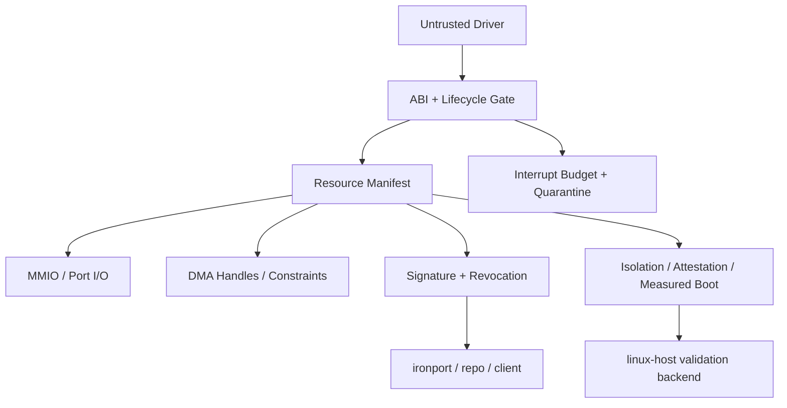

# Architecture Deep Dive

## Design Center

IronShim-rs is a small isolation core, not a full operating system. Its job is to sit between a driver and the hardware-facing services that the kernel is willing to expose.

The crate is built around four principles:

1. No ambient authority
2. Fail-closed defaults
3. Deterministic lifecycle and accounting
4. Verifiable delivery and validation

## Layer Map

## Core Modules

### `src/resource.rs`

This file is the authority boundary.

- `ResourcePolicy` denies MMIO and Port I/O unless the caller provides a policy that explicitly allows the access.
- `ResourceScope` binds a manifest to `driver_id`, `iommu_domain`, and `binding_nonce`.
- `ResourceManifest` owns the granted MMIO and Port I/O windows, revocation state, canonical serialization, and signature validation flow.
- `MmioRegion` and `IoPortRange` are typed wrappers that only materialize when the manifest authorizes them.
- PCI parsing helpers discover BARs, MSI/MSI-X counts, and device identities.

This is the heart of the fail-closed model.

### `src/dma.rs`

This layer defines the DMA contract between the kernel and the shim.

- `DmaAllocator` and `DmaMapper` abstract platform allocation and translation.
- `DmaConstraints` encode alignment, segment count, boundaries, and size constraints.
- `DmaHandle<T>` exposes typed access to a pinned DMA allocation while preserving the shim's bounds checks.
- `DmaScatterList` models segmented DMA plans for devices that cannot work from a single contiguous buffer.

The driver does not get to invent physical addresses.

### `src/driver.rs`

This file defines the lifecycle and execution contract.

- `DriverState` tracks the driver from `Created` to `Shutdown` or `Quarantined`.
- `DriverLifecycle` enforces valid transitions instead of letting the embedding kernel improvise.
- `SandboxProfile` describes DMA, MMIO, and interrupt budgets that the kernel wants enforced.
- `DriverContext` is the dependency bundle passed into the driver.
- `Driver` is intentionally explicit about `init`, `start`, `suspend`, `resume`, `shutdown`, and `handle_interrupt`.

This keeps driver control flow inspectable and testable.

### `src/interrupt.rs`

This layer handles interrupt containment.

- `InterruptBudget` tracks consumption over time.
- `InterruptMetrics` records the quarantine reason and budget overruns.
- `WorkQueue` and `DeferredWork` separate the top-half interrupt reaction from deferred execution.
- `QuarantineReason` makes the containment signal visible instead of hiding it in logs.

The model is simple: noisy drivers lose privileges quickly.

### `src/platform.rs`

This file carries the higher-assurance platform model.

- `IsolationBinding` describes mapped DMA versus shared virtual addressing.
- `PciIsolationCaps` models ATS, PRI, PASID, and SVA capability surfaces.
- `VirtualFunctionBinding` and `VfResourceBudget` represent SR-IOV resource partitioning.
- `AerEvent` and `ContainmentDecision` map PCIe faults into actions.
- `DeviceAttestationReport` and `MeasuredBootState` let the embedding system tie device trust and boot trust into release gating.

This is how the crate grows from "resource bounds" into "system trust posture."

### `src/linux_backend.rs`

This file exists only behind `linux-host` on Linux.

- `SysfsPciDevice` opens PCI devices via sysfs and config space.
- `DoeMailbox` implements PCIe DOE request/response transport.
- `SpdmRequester` drives SPDM request flows.
- `AerSysfs` and `DpcBackend` bridge kernel telemetry and DPC recovery information.
- `SriovManager` controls VF counts and enumeration.
- `IommuFd` wraps IOAS, map/unmap, hardware page tables, and invalidation flows.
- `VfioDevice` binds devices to `iommufd` and hardware page tables.

This is a validation backend, not a dependency inversion leak into the `no_std` core.

### Tooling Binaries

- `ironport`: transforms and signs artifacts, emits provenance and SBOM sidecars
- `ironport-repo`: serves artifacts and TUF-style metadata
- `ironport-client`: verifies signatures, provenance, subject hashes, and rollback state

These tools let the same trust model continue after build time.

## Data Flow

### Driver Bring-Up

1. Kernel constructs a `ResourceManifest` with a concrete `ResourceScope`.
2. Kernel validates the manifest signature and revocation state.
3. Kernel allocates a `DriverContext` with DMA, IRQ, telemetry, audit, and syscall hooks.
4. Driver enters `Initialized` and then `Running`.
5. Driver receives typed access to MMIO, Port I/O, and DMA only through shim-owned handles.

### Fault Path

1. Driver exceeds IRQ budget, hits a revocation, or triggers a platform containment signal.
2. The shim records telemetry and audit data.
3. Lifecycle transitions to `Quarantined` or recovery is requested through the platform path.
4. The embedding kernel decides whether to destroy, restart, or isolate the driver further.

### Release Path

1. `ironport` emits the artifact, signature, provenance, in-toto, SLSA, and SPDX sidecars.
2. `ironport-repo` publishes the artifact plus TUF-style metadata.
3. `ironport-client` verifies artifact integrity, subject hashes, rollback state, and metadata freshness.
4. Optional measured boot and device attestation data can be checked before acceptance.

## Feature Gating

- The core crate remains `no_std`.
- `alloc` enables heap-backed helpers where needed.
- `std` is for host tooling and richer test harnesses.
- `linux-host` enables the Linux backend and nothing else.
- `kani`, `fuzzing`, and `loom` are assurance features, not runtime dependencies.

## Intended Integration Style

IronShim-rs is designed to be embedded into a kernel or hypervisor-like environment that already owns:

- physical memory management
- interrupt routing
- syscall mediation
- device enumeration policy
- audit and telemetry sinks

The shim narrows and structures those powers; it does not replace them.
