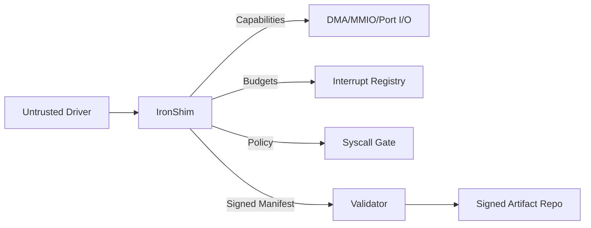

# IronShim-rs Documentation (EN)

## Quick Links

- [Project README](../README.md)
- [Turkish Documentation](README.tr.md)

## Purpose

IronShim-rs is a `no_std` Rust micro-shim isolation layer for untrusted drivers, built for bare-metal operating systems. It constrains DMA/MMIO/Port I/O access with capability objects, enforces interrupt budgets, and validates signed manifests to keep driver behavior inside strict boundaries.

## Design Goals

- Isolate untrusted drivers from kernel hardware access.
- Enforce capability-based access without raw pointers.
- Provide deterministic ABI compatibility checks.
- Keep the core `no_std` for bare metal usage.
- Support external signing and verification workflows.

## Core Concepts

### Capability Boundary

Each driver has a unique `DriverTag`. Hardware resources are wrapped in capability objects that carry this tag, so resources cannot be reused across drivers at the type level.

### DMA Safety

`DmaHandle<T>` exposes only bounded offsets inside the manifest-defined region. Translation is checked for overflow and valid physical addresses.

### Manifest Validation

`ResourceManifest` defines all allowed MMIO/Port/DMA regions. Manifests can be signed and verified using the `ManifestValidator` hook with revocation checks.

### Interrupt Isolation

Interrupt handlers are registered with `InterruptBudget`. Overuse triggers quarantine and telemetry/audit events.

### ABI Compatibility

`DriverAbiDescriptor` and `validate_driver_abi_compat` enforce version/feature constraints and bindgen layout correctness.

### Syscall Policy Hook

`SyscallPolicy` and `enforce_syscall` enable kernel-side allow/deny checks and audit recording.

## Architecture Diagram



## Integration Guide (Bare Metal OS)

### 1) Implement kernel traits

- `DmaAllocator`
- `InterruptRegistry`
- `TelemetrySink`
- `AuditSink`
- `SyscallPolicy`
- `PciConfigAccess` + `PciTopology` or `KernelPciBridge`

### 2) Populate manifests during driver load

- Create `ResourceManifest<DriverTag, ...>` with MMIO, Port, DMA limits.
- Pass it into the shim driver lifecycle.

### 3) Enforce syscall policy

- Call `enforce_syscall` on each driver-originated syscall request.

### 4) Bind PCI discovery

- Provide a kernel implementation of `KernelPciBridge` or direct `PciConfigAccess` + `PciTopology`.

### 5) Connect signature validation

- Implement `ManifestValidator` using your signature backend.
- Feed revocation data into `RevocationList`.

## Integration Checklist

- Kernel PCI bridge/topology implementation
- Syscall policy enforcement
- Manifest signing and revocation feed
- Telemetry and audit sinks wired to kernel logging

## Signing & Verification (Tooling)

The user-space tools (`ironport`, `ironport-repo`, `ironport-client`) support signed artifacts.

### Environment Variables

- `IRONPORT_SIGN_CMD`: external signing command. Payload is sent via stdin.
- `IRONPORT_VERIFY_CMD`: external verification command. Payload via stdin, signature via `{sig}`.
- `IRONPORT_KEY_ID`: key identifier for the signer.
- `IRONPORT_PREV_KEY_ID`: previous key id for rotation.
- `IRONPORT_KEY_EXPIRES`: key expiration epoch.
- `IRONPORT_LTO_CMD`: optional external LTO command for build pipeline integration.

### Signature Format

`SIG2:ALG:KEY_ID:PREV_ID:ISSUED:EXPIRES:SIG_HEX`

Supported `ALG` values:
- `HMAC-SHA256` (built-in for dev)
- `EXT` (external signer/validator)

## Example Workflow

```bash
ironport extract linux.c ported.c v1 pattern.toml
ironport apply pattern.toml input.c output.c
ironport-repo 127.0.0.1:8080 repo_dir
ironport-client 127.0.0.1:8080 get-verified output.c out.c
```

## Threat Model Summary

- Drivers cannot read/write outside manifest-defined regions.
- IRQ abuse triggers quarantine and budget enforcement.
- Manifest tampering is blocked by signature checks.

## Roadmap

- OS-specific PCI bridge binding
- CI workflows for clippy/fmt/miri/loom/fuzz
- HSM/TPM-backed signing integration

## Repository Layout

- `src/lib.rs`: core `no_std` API
- `src/resource.rs`: manifest, PCI parsing, signatures
- `src/driver.rs`: driver lifecycle and context
- `src/interrupt.rs`: IRQ isolation and budgets
- `src/dma.rs`: DMA isolation and handles
- `src/bin/ironport.rs`: transformation + signing tool
- `src/bin/ironport_repo.rs`: artifact repository
- `src/bin/ironport_client.rs`: client downloader

## Build & Test

```bash
cargo test
```
