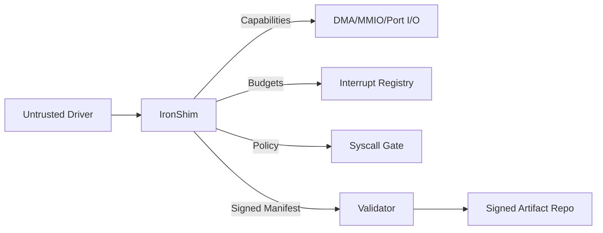

# IronShim-rs Dokümantasyon (TR)

## Hızlı Bağlantılar

- [Proje README](../README.md)
- [English Documentation](README.en.md)

## Amaç

IronShim-rs, bare metal işletim sistemleri için tasarlanmış `no_std` Rust micro-shim izolasyon katmanıdır. DMA/MMIO/Port I/O erişimini yetenek nesneleriyle sınırlar, kesmeleri bütçelerle izole eder ve imzalı manifest doğrulamasıyla sürücü davranışını kontrol altında tutar.

## Tasarım Hedefleri

- Güvenilmeyen sürücüleri kernel donanım erişiminden izole etmek.
- Raw pointer vermeden capability temelli erişim sağlamak.
- Deterministik ABI uyumluluk kontrolleri sunmak.
- Çekirdekte `no_std` uyumluluğunu korumak.
- Dış imzalama/doğrulama altyapılarıyla çalışmak.

## Temel Kavramlar

### Capability Sınırı

Her sürücü benzersiz `DriverTag` tipine sahiptir. Donanım kaynakları bu tag’i taşıyan capability nesneleriyle sarılır, böylece sürücüler arası kaynak karışması tip seviyesinde engellenir.

### DMA Güvenliği

`DmaHandle<T>` sadece manifestte izin verilen aralıklar içinde offset sağlar. Çeviri overflow ve fiziksel adres doğrulaması içerir.

### Manifest Doğrulaması

`ResourceManifest` tüm MMIO/Port/DMA limitlerini tanımlar. `ManifestValidator` ile imza doğrulanır ve `RevocationList` ile iptal kontrolü yapılır.

### Kesme İzolasyonu

Kesme handler’ları `InterruptBudget` ile sınırlandırılır. Aşım durumunda quarantine devreye girer, telemetry/audit kayıtları üretilir.

### ABI Uyumluluğu

`DriverAbiDescriptor` ve `validate_driver_abi_compat` ile sürüm/feature uyumu ve bindgen layout doğruluğu kontrol edilir.

### Syscall Politikası

`SyscallPolicy` ve `enforce_syscall` kernel tarafında allow/deny kontrolü ve audit kaydı sağlar.

## Mimari Diyagram



## Entegrasyon Rehberi (Bare Metal OS)

### 1) Kernel trait’lerini implemente et

- `DmaAllocator`
- `InterruptRegistry`
- `TelemetrySink`
- `AuditSink`
- `SyscallPolicy`
- `PciConfigAccess` + `PciTopology` veya `KernelPciBridge`

### 2) Driver yüklemede manifest üret

- `ResourceManifest<DriverTag, ...>` oluştur ve limitleri doldur.
- Driver lifecycle’a aktar.

### 3) Syscall politikasını uygula

- Her syscall isteğinde `enforce_syscall` çağır.

### 4) PCI keşfini bağla

- `KernelPciBridge` veya doğrudan `PciConfigAccess` + `PciTopology` kullan.

### 5) İmza doğrulamayı bağla

- `ManifestValidator` ile imza doğrula.
- `RevocationList` ile iptal listesi uygula.

## Entegrasyon Kontrol Listesi

- Kernel PCI bridge/topology implementasyonu
- Syscall politikası enforcement
- Manifest imzalama ve revocation beslemesi
- Telemetry ve audit sink’lerinin kernel log’a bağlanması

## İmzalama ve Doğrulama (Tooling)

User-space araçlar (`ironport`, `ironport-repo`, `ironport-client`) imzalı artefact destekler.

### Ortam Değişkenleri

- `IRONPORT_SIGN_CMD`: dış imzalama komutu. Payload stdin ile gelir.
- `IRONPORT_VERIFY_CMD`: dış doğrulama komutu. Payload stdin, imza `{sig}` ile verilir.
- `IRONPORT_KEY_ID`: imzalayıcı key id.
- `IRONPORT_PREV_KEY_ID`: rotation için önceki key id.
- `IRONPORT_KEY_EXPIRES`: key bitiş epoch.
- `IRONPORT_LTO_CMD`: isteğe bağlı dış LTO komutu.

### İmza Formatı

`SIG2:ALG:KEY_ID:PREV_ID:ISSUED:EXPIRES:SIG_HEX`

Desteklenen `ALG` değerleri:
- `HMAC-SHA256` (geliştirme için)
- `EXT` (dış imzalama/doğrulama)

## Örnek Akış

```bash
ironport extract linux.c ported.c v1 pattern.toml
ironport apply pattern.toml input.c output.c
ironport-repo 127.0.0.1:8080 repo_dir
ironport-client 127.0.0.1:8080 get-verified output.c out.c
```

## Tehdit Modeli Özeti

- Sürücü manifest dışına çıkamaz.
- IRQ suistimali budget ve quarantine ile engellenir.
- Manifest manipülasyonu imza doğrulama ile bloklanır.

## Yol Haritası

- OS’e özel PCI bridge bağlama
- clippy/fmt/miri/loom/fuzz için CI iş akışları
- HSM/TPM destekli imza entegrasyonu

## Repo Yapısı

- `src/lib.rs`: core `no_std` API
- `src/resource.rs`: manifest, PCI parsing, imza
- `src/driver.rs`: driver lifecycle ve context
- `src/interrupt.rs`: IRQ izolasyonu ve budget
- `src/dma.rs`: DMA izolasyonu ve handle’lar
- `src/bin/ironport.rs`: dönüşüm + imzalama aracı
- `src/bin/ironport_repo.rs`: artefact repo
- `src/bin/ironport_client.rs`: istemci downloader

## Build ve Test

```bash
cargo test
```
